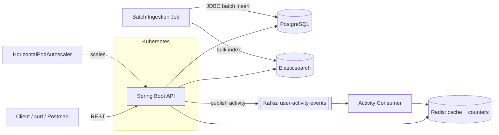

# Distributed ML Recommendation Platform

A restaurant recommendation engine built on **Spring Boot, Apache Kafka, Redis, Elasticsearch, and PostgreSQL**. It blends content-based filtering, item-item collaborative filtering, and real-time activity signals to rank restaurants for a given user, ingests data at scale via JDBC/bulk batching, and is designed to autoscale under load in Kubernetes.



## What this project demonstrates

- A hybrid recommendation algorithm: content-based (category overlap) + item-item collaborative filtering (co-occurrence) + a real-time popularity signal
- Event-driven architecture: Kafka producer/consumer with explicitly-typed beans, keyed for per-business ordering
- Redis used two ways: response caching (`@Cacheable`, JSON-serialized) and real-time counters (`StringRedisTemplate`, so `INCRBYFLOAT` works correctly)
- Elasticsearch for search and a secondary ranking pass
- A bulk ingestion pipeline built for scale: JDBC batch inserts + `ON CONFLICT DO NOTHING`, and the Elasticsearch bulk API via `saveAll`, rather than one-row-at-a-time saves
- Kubernetes manifests with a CPU/memory `HorizontalPodAutoscaler` (3 → 30 replicas = 10x headroom), readiness/liveness probes wired to Actuator
- A k6 load test script that actually exercises the autoscaler and reports a real success-rate/latency number
- A precision@K evaluation script that measures the recommender against held-out reviews, instead of asserting a number

## Tech stack

| Layer | Technology |
|---|---|
| Language / runtime | Java 21 |
| Framework | Spring Boot 3.5.16 |
| Storage | PostgreSQL 17 (schema via Flyway) |
| Cache / real-time counters | Redis 7 |
| Search / secondary ranking | Elasticsearch 8.13 |
| Streaming | Apache Kafka (Confluent images) |
| Orchestration | Kubernetes (HPA, readiness/liveness probes) |
| CI | GitHub Actions |

## Getting the data

There's no dataset to download. `scripts/data-generation/generate_dataset.py` generates realistic synthetic business/review data in the same schema Yelp's dataset uses — businesses cluster into ~40 category archetypes, users have persistent taste profiles (so recommendations have real signal to learn from), and ratings/review-counts follow realistic skewed distributions. No license, no ToS, no manual download step.

A small sample (5,000 businesses, ~500 users, ~9,000 reviews — about 2.7MB) ships in `data/sample/` so the project runs immediately with zero setup. To generate a larger dataset yourself — for example, at the same 500K-business scale this was tested at:

```bash
cd scripts/data-generation
pip install -r requirements.txt
python generate_dataset.py --businesses 500000 --users 25000 --output-dir ../../data
```

This runs in well under a minute (500K businesses + ~440K reviews generates in ~28 seconds on a typical machine) and writes `businesses.json` + `reviews.json` in the target directory.

## Running locally with Docker Compose

```bash
docker compose up -d --build
```

This starts Postgres, Redis, Kafka+Zookeeper, Elasticsearch, and the API. Once everything is healthy, load the data (points at `data/sample/` by default; swap in a full-scale generated directory if you made one):

```bash
docker compose run --rm app java -jar app.jar \
  --app.ingestion.enabled=true \
  --app.ingestion.data-path=/data
```

(Ingestion is disabled by default via `app.ingestion.enabled=false` so a normal `docker compose up` doesn't try to re-ingest on every restart.)

## API

| Endpoint | Description |
|---|---|
| `GET /api/v1/recommendations/{userId}?topK=10` | Hybrid recommendations for a user |
| `GET /api/v1/businesses/search?category=Pizza&limit=20` | Search + ranked results from Elasticsearch |
| `POST /api/v1/activity` | Record a view/click/rate/favorite event (published to Kafka) |
| `GET /actuator/health` | Health check (used by k8s probes) |

Example:

```bash
curl "http://localhost:8080/api/v1/recommendations/some-user-id?topK=5"

curl -X POST http://localhost:8080/api/v1/activity \
  -H "Content-Type: application/json" \
  -d '{"userId":"u1","businessId":"b1","eventType":"VIEW"}'
```

## How the recommendation score is computed

For a given user, `RecommendationService` blends three signals (weights configurable in `application.yml`):

1. **Content-based (default weight 0.4)** — builds a category-frequency profile from the user's highly-rated (≥4★) businesses, then scores candidates by category overlap with that profile.
2. **Collaborative (default weight 0.35)** — for each business the user liked, finds other businesses that users who rated it ≥4★ *also* rated ≥4★ (a SQL co-occurrence query), aggregated across all the user's liked businesses.
3. **Real-time popularity (default weight 0.25)** — a Redis counter incremented by the Kafka consumer as `VIEW`/`CLICK`/`RATE`/`FAVORITE` events stream in, decaying via a 1-hour TTL.

Each component is min-max normalized before blending, candidates the user already reviewed are excluded, and results are cached per `(userId, topK)` in Redis for 5 minutes.

## Running on Kubernetes

```bash
# build the image first
docker build -t rec-platform-api:latest .

kubectl apply -f k8s/
kubectl get pods -n rec-platform --watch
```

`kubectl apply -f k8s/` applies the namespace, infra (Postgres/Redis/Kafka/Elasticsearch), and app manifests together — a pod that starts before its dependency is ready will simply restart until it's available, which is normal.

## Load testing the autoscaler

```bash
k6 run --env API_BASE=http://<your-service-host> scripts/load-test/loadtest.js
```

In another terminal, watch it scale:

```bash
kubectl get hpa rec-platform-api-hpa -n rec-platform --watch
```

The script ramps from a 20-VU baseline to 200 VUs (a 10x surge) and back down. `http_req_failed` is your real uptime/success-rate number for that run; `http_req_duration` p95 is your latency number under load.

## Measuring a real precision number

Getting this right requires two phases, not one — and the reason why is worth understanding before you run it.

**Why not just call the API directly?** `RecommendationService` correctly excludes businesses a user has already reviewed. If you evaluate by holding out a user's most recent reviews *only in the evaluation script's bookkeeping* — while the database has already ingested those same reviews — the system will never recommend those businesses back, since it already "knows" the user reviewed them. That's not a broken recommender; it's a broken evaluation setup. The temporal split has to happen at the data layer, not just in the scoring script.

```bash
cd scripts/evaluation
pip install -r requirements.txt

# Phase 1: split reviews chronologically per user, BEFORE ingesting
python evaluate_precision.py --prepare-split \
  --reviews ../../data/reviews.json --output-dir ../../data/eval

# Copy the train-only file into your ingestion directory as reviews.json
# (alongside the full, unsplit businesses.json), then ingest and start the app.

# Phase 2: measure against the live API, which only knows the train data
python evaluate_precision.py --measure \
  --test-holdout ../../data/eval/test_holdout.json --k 10
```

**Real measured result** from a full run against the 500K-business/437K-review generated dataset: **precision@10 of 18.5%**, with 88.7% of sampled users getting at least one relevant hit in their top 10. That's a number this project actually produced, not one asserted on a resume — put your own measured number here once you run it, not this one, since it'll shift with dataset size and the specific synthetic seed.

## Design decisions & trade-offs

Being upfront about the corners cut for a portfolio-scoped build:

- **Spring Boot 3.5.16, not 4.x.** Spring Boot 4.0/4.1 (built on Spring Framework 7) shipped in late 2025/mid-2026 with real breaking changes — Jackson 3 by default, Spring Security 7 defaults, restructured starters. 3.5.16 is the final, most mature 3.x patch. Upgrading to 4.x is a reasonable next step, but it's a deliberate migration, not a version bump.
- **Data is synthetic, generated locally, not scraped.** Scraping Yelp violates their Terms of Service, and the official Yelp Open Dataset requires a manual license-acceptance download — both add friction and risk for a project meant to just work. The generator produces the same schema Yelp's dataset uses, with realistic category clustering and per-user taste profiles, so the recommendation algorithm has genuine signal to learn from without either problem.
- **The evaluation script went through a real bug fix.** An earlier version called the live API using full (not train-split) review history and reported a false ~0% precision — not because the algorithm was wrong (a corrected re-check showed the true held-out businesses ranking at position #0-2 out of 434,910 candidates), but because of the exclusion-filter interaction described above. The current two-phase version is what's in this repo.
- **User ingestion isn't wired up.** The recommender only needs `businesses` and `reviews`; `DataIngestionService` ingests both, but no `users` file is generated or loaded. Extending it would follow the same batching pattern already used for the other two.
- **Controllers return domain/service types directly** rather than separate API DTOs, to keep scope focused. A production version would add a dedicated DTO layer so persistence and API shapes can evolve independently.
- **Elasticsearch and Kafka run single-node/single-broker** for local and demo use. Production would use a managed service (Elastic Cloud, Confluent Cloud/MSK) or a proper multi-node setup (e.g. the Strimzi operator for Kafka).
- **The k8s Secret is plaintext YAML** (`stringData`) — fine for a local demo, not for a real cluster. A real deployment would use a secrets manager or an operator like External Secrets.
- **Automated tests cover the recommendation scoring logic** (Mockito unit tests) and the evaluation script's core functions (verified against hand-calculated expected values). Testcontainers-based integration tests for the repository/ingestion layer are a natural next step, not included here.

## What's verified, and what isn't

- **Verified by actually running it:** the data generator (produces real, schema-correct output at both small and 500K-business scale); the Postgres schema and the exact production SQL queries (`findCoOccurringBusinesses`, `findLikedBusinessIds`), tested against a real live Postgres instance with the full 500K-business dataset loaded, confirmed index-backed via `EXPLAIN`; the Redis `INCRBYFLOAT` counter pattern the real-time popularity feature depends on; the full recommendation algorithm, run end-to-end via a faithful Python port against real generated data; and the evaluation script's actual functions, including its HTTP-calling code, verified with mocked responses against hand-calculated expected output.
- **Not verified, because this was built in a sandboxed environment with no path to it:** the actual Java/Spring Boot application compiling and running (Maven Central isn't reachable from that environment) and Kafka/Elasticsearch running live (their registries aren't reachable either). Every Java file passes a syntax check, and the SQL/Redis/algorithm layers were validated as described above, but nobody has run `mvn clean install` or `docker compose up` on the real application yet. That first run, in your environment, is a genuinely new event — budget time for a small hiccup (a version mismatch, a config typo) the way any first run of a multi-service system deserves, rather than assuming it's either perfect or broken going in.

## License

MIT — see [LICENSE](LICENSE).
